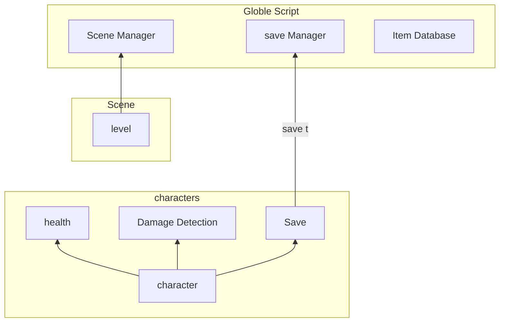

# High level Architecture

```mermaid
flowchart BT
   subgraph Globle Script
        scene[Scene Manager]
        save[save Manager]
        itemData[Item Database]
    end

    subgraph sceneData[Scene]
        level --> scene
    end

    subgraph characters[characters]

    character --> health
    character --> Damage[Damage Detection] 
    character --> saveObject[Save]

    saveObject --save to--> save

    end
```
